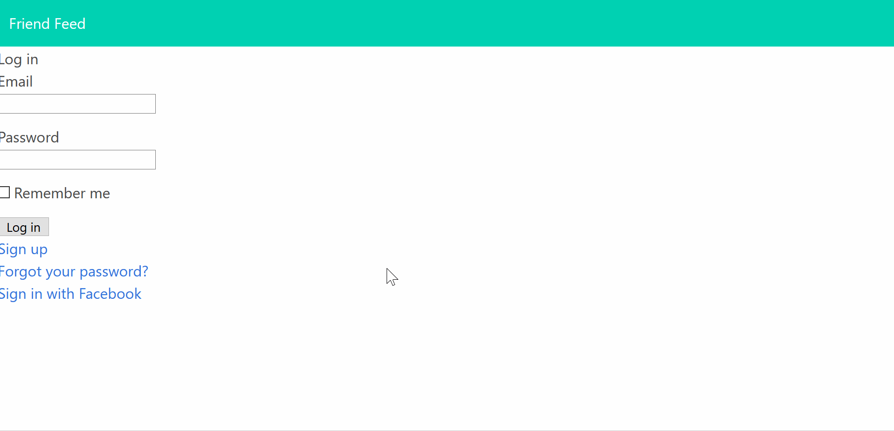
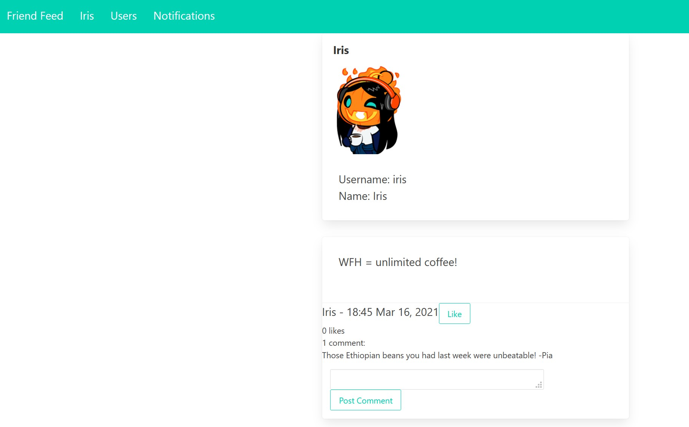

# FriendFeed

The beginnings of a Rails-based social website inspired by Facebook including the familiar concepts of 'liking', 'friending', and a news feed. You can  also sign up and sign in using an existing Facebook account.

## Access

FriendFeed is available [here](https://friend-feed.herokuapp.com/) and can be accessed by creating a new account or signing in with an existing Facebook account.

*Note - Accessing via Facebook may not work at points while Facebook works to verify the app. There is a .gif under Examples below showing how the process should look.*

## Features
* Friendships - send/accept/reject friend requests. You must be friends with another user in order to view their posts.
* News feed - keep up with your social network with the latest posts from your friends.
* Comments - add feedback to posts and comments within your social sphere.
* Likes - like posts or comments on posts to show your support to other users and their ideas.
* Notifications - you'll never miss a new connection with a notifications section keeping you in the know.
* Profile photos - personalize your profile by tying a face to your name!
* Facebook login - avoid managing another username and password by signing in with an existing Facebook account. Your username will be pulled from Facebook but your profile photo will remain fully customizable.

## Backlog
* Responsive design to suit mobile browsers.
* Front-end UX.
* Enhanced notifications.

## Examples

##### Login via Facebook:
 
##### User profiles:
 
##### Notifications:
 